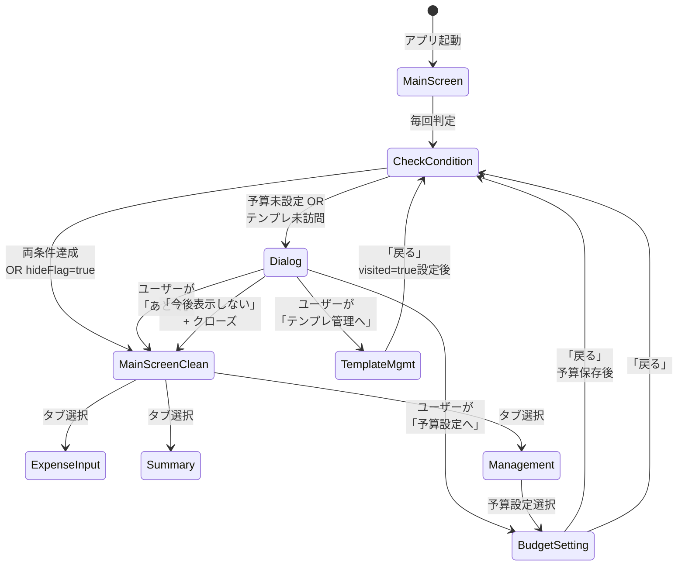

# 画面遷移仕様（初期設定導線）

## 概要
初回起動時のセットアップダイアログから、予算設定・テンプレ管理への導線、
および各画面からの戻り遷移で、ダイアログの再表示条件を明確に定義します。

---

## 対象
- 機能要件: FR-14（初回起動セットアップ案内）
- 対象画面:
  - MainScreen（ルート）
  - 初期設定ダイアログ
  - 予算設定
  - テンプレ管理

---

## 目的
- 初期設定の完了状態を明確に定義し、導線の迷子を防ぐ
- 恒久リンクは置かず、初期設定はダイアログ導線に統一
- ダイアログは「設定未完了」の条件が満たされている限り、再表示される

---

## 状態定義

### ビジネスロジック
- **`budgetExists`**: 当月予算が設定済み（`BudgetRepository.getBudgetByMonth(当月) != null`）
- **`templateManagementVisited`**: テンプレ管理画面を1回以上表示したか（`UserPreferencesDataStore.templateManagementVisited == true`）
- **`hideInitialSetupAnnouncement`**: ユーザーが「今後表示しない」をチェックしたか（`UserPreferencesDataStore.hideInitialSetupAnnouncement == true`）

### 表示条件

```
shouldShowInitialSetupDialog = 
  (hideInitialSetupAnnouncement == false) AND
  ((!budgetExists) OR (!templateManagementVisited))
```

**言葉に直すと**
- 「今後表示しない」がチェックされていない、かつ
- 予算が未設定、または テンプレ管理を訪問したことがない

---

## ダイアログ仕様

### 表示状態
```
┌─────────────────────────────────┐
│  セットアップ                   │
│                                 │
│  最初に予算を設定しておくと、   │
│  月の管理がしやすくなります。   │
│  テンプレを使うと入力も        │
│  早くなります。                 │
│                                 │
│  [予算設定へ]                   │
│  [テンプレ管理へ]               │
│  [あとで]                       │
│                                 │
│  ☐ 今後表示しない              │
└─────────────────────────────────┘
```

### ユーザー操作
| ボタン | 動作 | ダイアログ消去 | 画面遷移 |
|--------|------|---|---|
| 予算設定へ | 予算設定画面を open | はい | MainScreen → 予算設定 |
| テンプレ管理へ | テンプレ管理画面を open | はい | MainScreen → テンプレ管理 |
| あとで | ダイアログを閉じる | はい | 条件未達なら次回 MainScreen 表示時に再表示 |
| 今後表示しない（チェック） | `hideInitialSetupAnnouncement = true` を永続化 | - | - |

### ダイアログ表示中の下部タブ操作
- `AlertDialog` を使用するモーダル表示とする
- ダイアログ表示中は、下部タブや背面画面の操作はできない
- 画面遷移したい場合は「予算設定へ」「テンプレ管理へ」「あとで」のいずれかを選択する

---

## 画面遷移フロー

### 1. アプリ起動 → MainScreen

**処理フロー**
```
1. MainScreenViewModel が初期化
2. BudgetRepository から当月予算を非同期取得
3. UserPreferencesDataStore から各フラグ（hideInitialSetupAnnouncement, templateManagementVisited）を読み込み
4. shouldShowInitialSetupDialog を計算
5. 計算完了後、UI をレンダリング
   ├─ true → ダイアログを表示
   └─ false → ダイアログなし（MainScreen のみ表示）
```

---

### 2. ダイアログ → 予算設定画面

**遷移条件**
- ユーザーが「予算設定へ」をタップ

**予算設定画面での処理**
- ユーザーが金額を入力して保存
- **この時点で** BudgetRepository に当月予算が書き込まれる
- ユーザーが「戻る」ボタンを押す

**戻り処理**
```
1. MainScreen に遷移
2. MainScreenViewModel が再度 shouldShowInitialSetupDialog を計算
   ├─ 予算は今、設定済み（✓）
   ├─ テンプレ管理訪問状態を確認
   │  ├─ 訪問済み（✓）→ ダイアログなし
   │  └─ 未訪問（✗）→ ダイアログ再表示
```

**結果パターン**
| 予算 | テンプレ訪問 | ダイアログ | 理由 |
|-----|--------|---|---|
| 設定済 | 訪問済 | なし | 両条件達成 |
| 設定済 | 未訪問 | 表示 | テンプレ設定が必要 |

---

### 3. ダイアログ → テンプレ管理画面

**遷移条件**
- ユーザーが「テンプレ管理へ」をタップ

**テンプレ管理画面での処理**
```kotlin
// TemplateManagementScreen.kt
LaunchedEffect(Unit) {
  viewModel.markTemplateManagementVisited()  // ← 画面表示【即座】に visited = true をセット
}
```

**テンプレ管理画面の操作**
- ユーザーがテンプレを作成/編集/削除 する、または操作しない
- ユーザーが「戻る」ボタンを押す

**戻り処理**
```
1. MainScreen に遷移
2. MainScreenViewModel が再度 shouldShowInitialSetupDialog を計算
   ├─ テンプレ管理は訪問済み（✓）
   ├─ 予算設定状態を確認
   │  ├─ 設定済み（✓）→ ダイアログなし
   │  └─ 未設定（✗）→ ダイアログ再表示
```

**結果パターン**
| 予算 | テンプレ訪問 | ダイアログ | 理由 |
|-----|--------|---|---|
| 設定済 | 訪問済 | なし | 両条件達成 |
| 未設定 | 訪問済 | 表示 | 予算設定が必要 |

---

### 4. ダイアログ「あとで」でクローズ

**処理**
- ダイアログが閉じられる
- MainScreen（下部タブあり）が見える
- ユーザーは通常の操作（支出入力など）を続行可能

**その後、条件未達の場合の再表示**
```
例: 「あとで」で閉じた → 「支出入力」操作 → 「管理」で予算設定 → 予算保存 → 「戻る」
→ MainScreen に戻る際に、ダイアログ再表示（予算は設定済みだが、テンプレ未訪問）
```

---

### 5. 「今後表示しない」チェック後

**処理**
- ユーザーが「今後表示しない」をチェック
- ユーザーが「あとで」（または他のボタン）をタップ
- `UserPreferencesDataStore.hideInitialSetupAnnouncement = true` を永続化

**以降の動作**
- このデバイスではダイアログは**一切表示されない**
- バックアップ＆復元時は復元元の状態が復元される

---

## 判定と再計算のタイミング

| タイミング | 誰が | 何を | どこで |
|-----------|------|------|--------|
| アプリ起動 | MainScreenViewModel | shouldShowInitialSetupDialog | 初期化時 |
| 予算設定から戻る | MainScreenViewModel | shouldShowInitialSetupDialog（budgetExists が変わる） | NavigationEffect |
| テンプレ管理から戻る | MainScreenViewModel | shouldShowInitialSetupDialog（templateManagementVisited が既に変わっている） | NavigationEffect |
| 「管理」から予算設定（初期設定ダイアログ経由ではない） | MainScreenViewModel | shouldShowInitialSetupDialog | 戻る時 |

---

## 優先ルール
- `hideInitialSetupAnnouncement = true` の場合、`budgetExists` と `templateManagementVisited` が未達でもダイアログを表示しない。
- つまり表示優先順位は以下とする。
  1. `hideInitialSetupAnnouncement` の値
  2. `budgetExists` / `templateManagementVisited` の自動判定

---

## 設定からの再表示

### 設定画面項目
- 項目名: 初期設定ガイドを再表示
- 動作: `hideInitialSetupAnnouncement = false` を保存

### 再表示フロー
1. ユーザーが設定画面で「初期設定ガイドを再表示」を選択
2. `hideInitialSetupAnnouncement` が false になる
3. 次回 MainScreen 表示時に通常判定へ復帰
4. `!budgetExists || !templateManagementVisited` ならダイアログを表示

---

## 管理メニューからの既存遷移との関係

### 初期設定完了後（両条件達成）
- 管理メニュー → 予算設定/テンプレ管理/その他 → 通常どおり
- 帰路は「戻る」で管理メニューへ
- **ダイアログは表示されない**

### 初期設定完了前（条件未達）
- 管理メニュー → 予算設定 → 保存 → 「戻る」 → MainScreen
- → shouldShowInitialSetupDialog を再計算
- → 条件未達なら **ダイアログ再表示可能**

---

## 実装チェックリスト

- [ ] `UserPreferencesDataStore` に `templateManagementVisited` フラグを追加
  - PreferenceKey の定義
  - Flow getter / setter メソッド
  - SettingsSnapshot に含める

- [ ] `MainScreenViewModel` に `BudgetRepository` を注入
  - 当月予算の存在チェック機能
  - `combine()` で複数 Flow を統合

- [ ] `MainScreenViewModel.shouldShowInitialSetupDialog` ロジックを更新
  ```
  oldLogic: hideInitialSetupAnnouncement == false
  newLogic: (hideInitialSetupAnnouncement == false) AND 
            ((budgetNotSet) OR (templateNotVisited))
  ```

- [ ] `TemplateManagementScreen` に LaunchedEffect を追加
  ```kotlin
  LaunchedEffect(Unit) {
    viewModel.markTemplateManagementVisited()
  }
  ```

- [ ] `MainScreenRouteTest` に新ロジックのテストケース追加
  - 予算設定 / テンプレ訪問 の各組み合わせ

- [ ] バックアップ＆復元対象に `templateManagementVisited` を含める

---

## 状態遷移図



---

## 用語

- **Main Screen**: ルート画面（下部タブあり）
- **shouldShowInitialSetupDialog**: ダイアログ表示判定フラグ（StateFlow<Boolean>）
- **hideInitialSetupAnnouncement**: ユーザーが一度「今後表示しない」をチェックしたフラグ
- **templateManagementVisited**: テンプレ管理画面を訪問したフラグ
- **budgetExists**: 当月予算が存在するかどうか

## 遷移表
| 条件 | ダイアログ表示 | 期待遷移 |
|---|---|---|
| hasBudget=false, hasVisitedTemplateManagement=false | 表示 | 予算設定またはテンプレ管理へ誘導 |
| hasBudget=true, hasVisitedTemplateManagement=false | 表示 | テンプレ管理へ誘導 |
| hasBudget=false, hasVisitedTemplateManagement=true | 表示 | 予算設定へ誘導 |
| hasBudget=true, hasVisitedTemplateManagement=true | 非表示 | 通常利用 |

## 非機能要件
- 条件評価はUI表示を阻害しない（非同期読取を前提）。
- 判定待ち中の誤表示（チラつき）を防止する。

## 備考
- 以前の「今後表示しない」仕様は本仕様では採用しない。
- 初期設定完了状態は、行動実績に基づく（予算有無・テンプレ管理表示履歴）。
